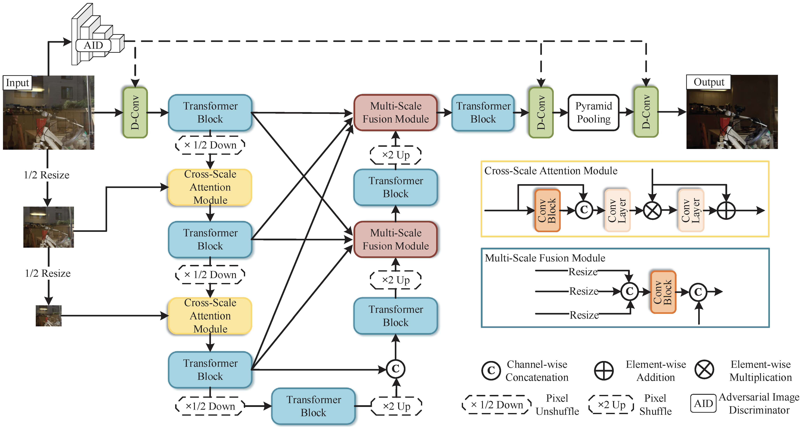
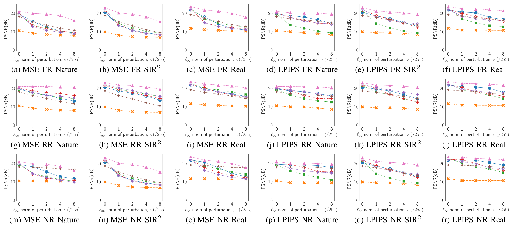
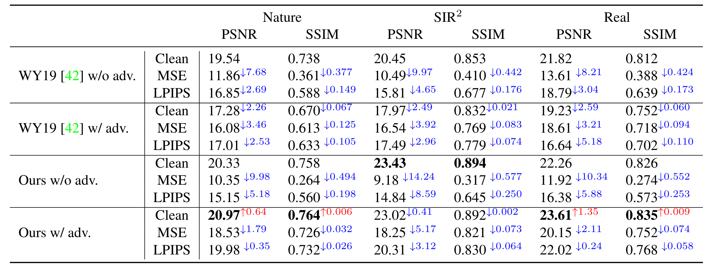

<p align="center">
    <!-- <a href="https://arxiv.org/abs/2310.05077">
    </a> -->
    <a href="https://openaccess.thecvf.com/content/CVPR2023/papers/Song_Robust_Single_Image_Reflection_Removal_Against_Adversarial_Attacks_CVPR_2023_paper.pdf"></a>
    <a href="https://github.com/ZhenboSong/RobustSIRR">
    </a>
    <a href="https://github.com/ZhenboSong/RobustSIRR/blob/main/LICENSE"></a>
    
</p>

<h1 align="center">Robust Single Image Reflection Removal Against Adversarial Attacks  (CVPR 2023)</h1>

Zhenbo Song *, Zhenyuan Zhang *, [Kaihao Zhang](https://zhangkaihao.github.io/), [Wenhan Luo](https://whluo.github.io/), [Zhaoxin Fan](https://zhaoxinf.github.io/), [Wenqi Ren](https://sites.google.com/view/wenqiren/homepage), Jianfeng Lu

**Keywords**: reflection removal, adversarial attack

**Abstracts**: This paper addresses the problem of robust deep single-image reflection removal (SIRR) against adversarial attacks. Current deep learning-based SIRR methods have shown significant performance degradation due to unnoticeable distortions and perturbations on input images. For a comprehensive robustness study, we first conduct diverse adversarial attacks specifically for the SIRR problem, i.e. towards different attacking targets and regions. Then we propose a robust SIRR model, which integrates the cross-scale attention module, the multi-scale fusion module, and the adversarial image discriminator. By exploiting the multi-scale mechanism, the model narrows the gap between features from clean and adversarial images. The image discriminator adaptively distinguishes clean or noisy inputs, and thus further gains reliable robustness. Extensive experiments on Nature, SIR<sup>2</sup>, and Real datasets demonstrate that our model remarkably improves the robustness of SIRR across disparate scenes. 



<p align="center">:star2: If RobustSIRR is helpful to your images or projects, please help star this repo. Thanks! :hugs:</p>


# The Table of Contents
- [:house: Dependencies and installation](#house-dependencies-and-installation)
- [:clap: How to run](#clap-how-to-run)
  - [:one: Download Pre-trained Models](#one-download-pre-trained-models)
  - [:two:Prepare Dataset](#two-prepare-dataset)
    - [Training Dataset](#training-dataset)
    - [Testing Dataset](#testing-dataset)
    - [Dataset Architectures](#dataset-architectures)
  - [:three: Train](#three-train)
  - [:four: Test](#four-test)
  - [:five: Evaluate the Robustness of Our model on All dataset](#five-evaluate-the-robustness-of-our-model-on-all-dataset)
- [:relaxed: Results](#relaxed-results)
- [:fire: Citation](#fire-citation)
- [:sparkles: Acknowledgement](#sparkles-acknowledgement)
- [:heart: Contact](#heart-contact)

# :house: Dependencies and installation

- Python >= 3.8.5
- PyTorch >= 1.11
- CUDA >= 11.3
- Other required packages in `requirements.txt`

```
# git clone this repository
git clone https://github.com/ZhenboSong/RobustSIRR.git
cd RobustSIRR

# create new anaconda env
conda create -n sirr python=3.8 -y
conda activate sirr

# install python dependencies by pip
pip install -r requirements.txt
```

# :clap: How to run

## :one: Download Pre-trained Models

:star2: Download the pre-trained RobustSIRR models from [[Pre-trained_RobustSIRR_BaiduYunDisk](https://pan.baidu.com/s/1Q0ghK9UqiC4vMN9D75Gs3g?pwd=sirr) `(pwd:sirr)`, [Google Drvie](https://drive.google.com/file/d/1FSWba_EQTMd6pAzw-7AXORIWSZUHYA2C/view?usp=drive_link)] to the `checkpoints` folder. 

## :two: Prepare Dataset

### Training Dataset

- 7,643 cropped images with size 224 × 224 from  [Pascal VOC dataset](http://host.robots.ox.ac.uk/pascal/VOC/) (image ids are provided in VOC2012_224_train_png.txt, you should crop the center region with size 224 x 224 to reproduce our result )
- 90(89) real-world training images from [Berkeley real dataset](https://github.com/ceciliavision/perceptual-reflection-removal)

:exclamation: Place the processed VOC2012 and real datasets in the `datasets` folder, and name them `VOC2012` and `real89` respectively. 

:star2:For convenience, you can directly download the prepared training dataset from [ [VOC2012_For_RobustSIRR_BaiduYunDisk](https://pan.baidu.com/s/1Ph4Ig41TUWrPNjHUekQ3Iw?pwd=sirr) `(pwd:sirr)` , [Google Drvie](https://drive.google.com/file/d/1oBCLguw02oRyWjL6F9iV27dboMfgwZHw/view?usp=drive_link)] and [ [real89_For_RobustSIRR_BaiduYunDisk](https://pan.baidu.com/s/1tMHYUsaTABuDJeu_tbj_5Q?pwd=sirr) `(pwd:sirr)` , [Google Drvie](https://drive.google.com/file/d/1xUrOkNSZzEvteCO8JwZXUOik2Z_pkdgZ/view?usp=drive_link)].

### Testing Dataset

- 20 real testing images from [Berkeley real dataset](https://github.com/ceciliavision/perceptual-reflection-removal)
- Three sub-datasets, namely ‘Objects’, ‘Postcard’, ‘Wild’ from [SIR<sup>2</sup> dataset](https://sir2data.github.io/) 
- 20 testing images from [Nature](https://drive.google.com/file/d/1YWkm80jWsjX6XwLTHOsa8zK3pSRalyCg/view) 

:exclamation: Place the processed datasets in the `datasets` folder, and name them as `real20`, `SIR2`, and `nature20` respectively. 

:star2:For convenience, you can directly download the prepared testing dataset from [ [TestingDataset_For_RobustSIRR_BaiduYunDisk](https://pan.baidu.com/s/1inDlzc9u5My6jlB-FBS1pw?pwd=sirr) `(pwd:sirr)` , [Google Drvie](https://drive.google.com/file/d/1HnFQZlw5Lh-6jqchd_60QrgTW_svTiIB/view?usp=drive_link)].  

### Dataset Architectures

The hierarchical structure of all datasets is illustrated in the following diagram. 

```
datasets
├── nature20
│   ├── blended
│   └── transmission_layer
├── real20
│   ├── blended
│   ├── real_test.txt
│   └── transmission_layer
├── real89
│   ├── blended
│   └── transmission_layer
├── SIR2
│   ├── PostcardDataset
│   │   ├── blended
│   │   ├── reflection
│   │   └── transmission_layer
│   ├── SolidObjectDataset
│   │   ├── blended
│   │   ├── reflection
│   │   └── transmission_layer
│   └── WildSceneDataset
│       ├── blended
│       ├── reflection
│       └── transmission_layer
└── VOC2012
    ├── blended
    ├── JPEGImages
    ├── reflection_layer
    ├── reflection_mask_layer
    ├── transmission_layer
    └── VOC_results_list.json
```

Note:

- `transmission_layer` is GT, `blended` is Input, and `reflection/reflection_layer` is the reflection part
- For the SIR^2 dataset, we only standardize the folder structure

## :three: Train

- For adv. training:

```shell
# To Be Released
```


- For clean images training:

```shell
# ours_cvpr
CUDA_VISIBLE_DEVICES=0 python train.py --name ours --gpu_id 0 --no-verbose --display_id -1 --batchSize 4

# ours_wo_aid 
CUDA_VISIBLE_DEVICES=0 python train.py --name ours_wo_aid --gpu_id 0 --no-verbose --display_id -1 --batchSize 4 --wo_aid

# ours_wo_aff
CUDA_VISIBLE_DEVICES=0 python train.py --name ours_wo_aff --gpu_id 0 --no-verbose --display_id -1 --batchSize 4 --wo_aff

# ours_wo_scm
CUDA_VISIBLE_DEVICES=0 python train.py --name ours_wo_scm --gpu_id 0 --no-verbose --display_id -1 --batchSize 4 --wo_scm

```
Note:

- Check `options/robustsirr/train_options.py` to see more training options.

## :four: Test
```shell
CUDA_VISIBLE_DEVICES=0 python test.py --name ours_cvpr --hyper --gpu_ids 0 -r --no-verbose --save_gt --save_attack --save_results
```

## :five: Evaluate the Robustness of Our model on All dataset

```shell
# To Be Released
# Due to confidentiality concerns. Alternatively, you can refer to https://github.com/yuyi-sd/Robust_Rain_Removal

```

# :relaxed: Results



:point_up: Comparison of the PSNR values with respect to perturbation levels $\epsilon$ for different attacks on various datasets. ‘MSE FR Nature’ represents attacking on **Full** Region with **MSE** objective on the Nature dataset, and so the others. 



:point_up: Comparison of different training strategies on three benchmark datasets. ‘w/’ and ‘w/o adv.’ mean training with or without adversarial images. **MSE** and **LPIPS** denote corresponding attacks over **Full** regions. &#8595; and &#8593; represent the degradation and improvement performance compared to the original prediction inputting clean images.


# :fire: Citation

If our work is useful for your research, please consider citing:

```
@InProceedings{Song_2023_CVPR,
    author    = {Song, Zhenbo and Zhang, Zhenyuan and Zhang, Kaihao and Luo, Wenhan and Fan, Zhaoxin and Ren, Wenqi and Lu, Jianfeng},
    title     = {Robust Single Image Reflection Removal Against Adversarial Attacks},
    booktitle = {Proceedings of the IEEE/CVF Conference on Computer Vision and Pattern Recognition (CVPR)},
    month     = {June},
    year      = {2023},
    pages     = {24688-24698}
}
```

# :sparkles: Acknowledgement

- This project is based on [ERRNet](https://github.com/Vandermode/ERRNet)

- Some codes are brought from [BasicSR](https://github.com/XPixelGroup/BasicSR), [Robust_Rain_Removal](https://github.com/yuyi-sd/Robust_Rain_Removal)

- This Readme is inspired by [CodeFormer](https://github.com/sczhou/CodeFormer) and [FedFed](https://github.com/visitworld123/FedFed)

- For More Awesome SIRR methods, you can refer to :+1: [Awesome-SIRR](https://github.com/Liar-zzy/Awesome-Single-Image-Reflection-Removal)

# :heart: Contact

If you have any questions, please feel free to reach out at [`songzb@njust.edu.cn`](mailto:songzb@njust.edu.cn) or [`zyzhang.bbetter@gmail.com`](mailto:zyzhang.bbetter@gmail.com).
